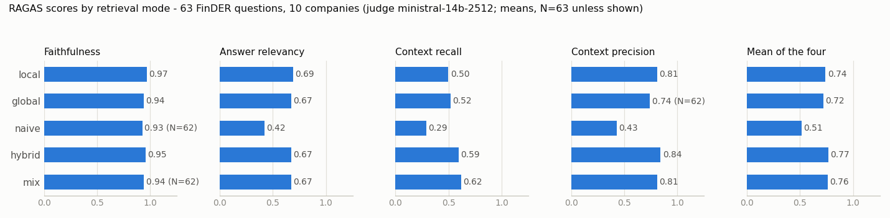
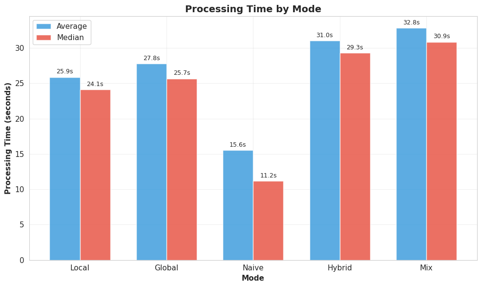
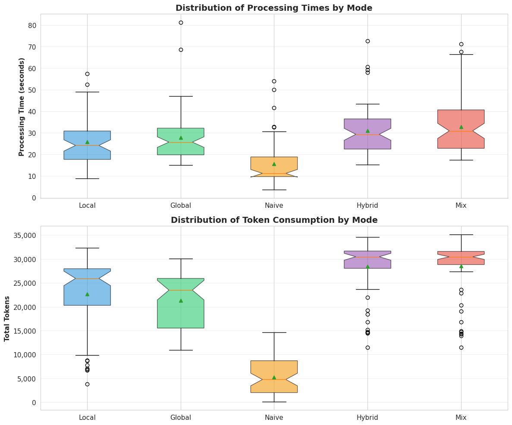
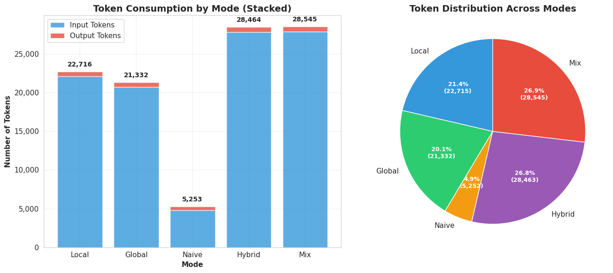

# Results: five LightRAG retrieval modes on FinDER 10-K questions

This page reports the benchmark runs made with this repository in January 2026. The data behind
every number is in this directory ([README.md](README.md) describes the files), and
`python results/summarize.py` prints every table below. The page only aggregates the saved
scores, timestamps and retrieval logs. Nothing was re-scored or re-run for it.

## Summary

- **Setup.** 63 FinDER analyst questions about 10 companies, answered from one LightRAG index of
  those companies' 10-K filings in all five modes. Answers come from `gemini-3-flash-preview`.
  RAGAS scored all 315 question-mode pairs with `ministral-14b-2512` as the judge.
- **The four graph modes scored 0.72 to 0.77 and `naive` scored 0.51.** These are mean RAGAS scores
  (the mean of faithfulness, answer relevancy, context recall and context precision). `hybrid`
  (0.765) and `mix` (0.760) are level: each beats the other on about half the questions. `local`
  (0.741) and `global` (0.718) trail them slightly.
- **`naive` got much less context.** `naive` passes only `chunk_top_k=10` chunks to the reranker,
  and `min_rerank_score=0.3` then drops the low scorers. On average it kept 3.1 chunks, about 19,000
  characters, and it kept none at all for 13 of the 63 questions. The graph modes sent 83,000 to
  111,000 characters to the answer model. Part of `naive`'s gap therefore reflects this threshold
  setting rather than vector retrieval as such. Still, `naive` also scored lower on the 18 questions
  where it kept 5 to 10 chunks (0.62 against 0.79 for `mix`).
- **Latency.** The median wall-clock time per mode, covering the answer call and the context call,
  was 11 s for `naive` and 24 to 31 s for the graph modes (single GPU, hosted Gemini).
- **Among the graph modes the margins are small.** The order is `hybrid` ≈ `mix` > `local` >
  `global`, with at most 0.047 between them in mean `ragas_score`. `hybrid` and `mix` each beat
  `global` on about two-thirds of the questions. All of this comes from one scoring pass, and
  scoring the same answer and context a second time moved context recall by up to 0.83 and context
  precision by up to 1.0 on single items. Ranking the graph modes with confidence would take repeat
  scorings or more questions.



## Run conditions

| | |
|---|---|
| Notebook | `lightrag_10k_priority_ticker_models_optimised_multimode.ipynb`, cells 1 to 6. Cell 7 (RAGAS) was not run; the scores come from the standalone batch script |
| Queries | 2026-01-19, 19:01 to 21:20 (timestamps in the result files) |
| Hardware | One NVIDIA GeForce RTX 4070 SUPER (12 GB), as reported in the notebook output |
| Index | 10 filings (HON, MSI, MRO, CE, HAS, VRSK, BIIB, ROP, CTAS, AMP). 531 chunks of 1,200 tokens with a 100-token overlap, 13,368 entities, 17,823 relations. An earlier session of the same notebook with the same extraction and embedding models built the workspace on 2026-01-15 and 16. This run found the filings already indexed and skipped them |
| Extraction LLM | `ministral-14b-2512` (Mistral API) |
| Embeddings | `intfloat/e5-mistral-7b-instruct`, 4-bit on CUDA. It is mean-pooled and truncated at 512 tokens (see the README's limitations) |
| Query | Two calls per question and mode with `top_k=60`, `chunk_top_k=10`, reranking on: one for the answer, one with `only_need_context=True` for the stored context |
| Reranker | `BAAI/bge-reranker-v2-m3` (fp16, CUDA), `min_rerank_score=0.3` |
| Answer LLM | `gemini-3-flash-preview`, default generation settings, 315 calls |
| Keywords | LightRAG extracts query keywords with an LLM before graph retrieval. The run's log shows one new keyword entry. The other 251 of the 252 keyword sets (4 graph modes × 63 questions) were read from the workspace's LLM cache, which the context-only runs of 2026-01-15 and 16 had written. The notebook version saved on 2026-01-15 ran those queries with `ministral-14b-2512`, so the keywords most likely come from that model and not from Gemini |
| Questions | The 63 FinDER training questions (of 5,703) that name one of the 10 tickers as `(XXX)` or at the end: HON, MSI and MRO have 7 each, the rest 6 each. 8 carry FinDER's `reasoning` flag |
| RAGAS | Faithfulness, AnswerRelevancy, ContextRecall, ContextPrecision. Judge `ministral-14b-2512` (Mistral API), embeddings `BAAI/bge-large-en-v1.5` on CPU. The whole retrieved context goes in as one context string, and FinDER's answer is the ground truth. Finished 2026-01-20 02:33, 315 of 315 evaluations succeeded |

**What failed or is missing.** All 315 query results have status `success`. No answer is empty,
LightRAG's no-context reply or a Gemini error string. Three RAGAS values are NaN: faithfulness
for one `naive` and one `mix` answer, and context precision for one `global` answer. They are left
out of the means, and the tables show N wherever it is below 63. `ragas_score` is the mean of the
non-NaN metrics. Only one run was made, so there are no repeats per question. The one piece of
evidence on scoring variance is the pilot re-scoring below. The published files leave out the text
of one answer (`daff6a7b`, `hybrid`), which an automated pre-publication check flagged. Its scores
are included (see [README.md](README.md)).

## RAGAS by mode

Means over questions. N=63 unless shown.

| mode | faithfulness | answer_relevancy | context_recall | context_precision | ragas_score |
|---|---|---|---|---|---|
| local | 0.966 | 0.688 | 0.499 | 0.810 | 0.741 |
| global | 0.937 | 0.673 | 0.518 | 0.742 (N=62) | 0.718 |
| naive | 0.927 (N=62) | 0.419 | 0.291 | 0.429 | 0.513 |
| hybrid | 0.953 | 0.673 | 0.595 | 0.841 | 0.765 |
| mix | 0.941 (N=62) | 0.674 | 0.618 | 0.810 | 0.760 |

Medians:

| mode | faithfulness | answer_relevancy | context_recall | context_precision | ragas_score |
|---|---|---|---|---|---|
| local | 1.00 | 0.78 | 0.67 | 1.00 | 0.84 |
| global | 0.97 | 0.77 | 0.60 | 1.00 | 0.79 |
| naive | 1.00 | 0.68 | 0.00 | 0.00 | 0.46 |
| hybrid | 0.98 | 0.78 | 0.75 | 1.00 | 0.86 |
| mix | 0.97 | 0.75 | 0.75 | 1.00 | 0.86 |

How to read the metrics here:

- **Faithfulness** is high everywhere (0.93 to 0.97). Gemini mostly stayed within the context it
  received, and when the context lacked the answer it tended to say so (see answer relevancy).
- **Answer relevancy** is 0 when the judge finds the answer noncommittal. `naive` has 29 zeros,
  and in 27 of them the answer says that the context does not contain the information. Several of
  these answers say outright that the document chunks they were given are empty.
- **Context precision** here is a single relevance judgement per answer, because the whole context
  is one string. The mean is therefore the share of contexts that the judge found useful.
- **Context recall** is the metric that separates the modes most: 0.29 for `naive` against 0.50 to
  0.62 for the graph modes.

## Retrieval and latency

| mode | duration_s median | duration_s mean | N timed | context chars (mean) | entities (mean) | relations (mean) | chunks kept (mean) | questions with 0 chunks | chunks from the asked company | answer chars (mean) |
|---|---|---|---|---|---|---|---|---|---|---|
| local | 24.1 | 25.9 | 62 | 88323 | 60.0 | 123.9 | 8.0 | 7 | 97% | 2456 |
| global | 25.7 | 27.8 | 63 | 82730 | 37.3 | 60.0 | 6.6 | 9 | 92% | 2517 |
| naive | 11.2 | 15.6 | 63 | 19107 | 0.0 | 0.0 | 3.1 | 13 | 92% | 1820 |
| hybrid | 29.3 | 31.0 | 63 | 111115 | 53.7 | 153.3 | 8.4 | 6 | 97% | 2658 |
| mix | 30.9 | 32.8 | 63 | 111490 | 53.3 | 154.3 | 8.4 | 6 | 98% | 2608 |

- **Duration** is the time between one mode's saved timestamp and the previous one's. It covers
  both LightRAG calls and the Gemini answer. The first mode of the first question has no previous
  timestamp, hence N=62 for `local`. Gemini generation is most of it. In the separate Gemini-only
  benchmark below, one answer call on the same saved contexts took a median of 27 to 30 s for the
  graph modes and 10 s for `naive`.
- **Chunks** counts the document chunks that survived the reranker's top 10 and the 0.3 threshold.
  The graph modes rerank 43 to 145 candidate chunks on average. `naive` reranks only its 10, so the
  threshold cuts it hardest. Its chunk counts per question were: 0 in 13 questions, 1 to 4 in 32,
  and 5 to 10 in 18.
- **Chunks from the asked company**: all ten filings share one index. Between 2% and 8% of the kept
  chunks came from another company's filing, for example a VRSK chunk in `naive`'s context for an
  MSI question. The graph modes also carry other companies' entities, which the chunk count does not
  measure. For the Cintas capex question `1bacc152`, `global`'s first 15 entities include Roper,
  Marathon Oil, Celanese and Motorola Solutions.
- The "tokens" in the charts below are characters / 4, as `analyze_mode_performance.py` estimates
  them. They are not API counts. The Gemini benchmark has real input-token counts: a median of 2,812
  for `naive` and 18,592 to 27,102 for the graph modes.





These charts come from `analyze_mode_performance.py` and `visualize_mode_performance.py` in this
repository, run on `five_mode_run/questions/`. The `mode_performance_analysis.json` that was
written on 2026-01-20 assigned each gap to the mode *before* the one that finished, so its
per-mode times are shifted by one mode. For example, its "local" time of 27.8 s is `global`'s. The
current script attributes each gap correctly, and the numbers above use it.

## Where the modes disagree

Head-to-head on `ragas_score` per question. Each cell reads row mode against column mode:
wins-ties-losses, then the mean difference.

| mode | local | global | naive | hybrid | mix |
|---|---|---|---|---|---|
| local | — | 34-0-29 (+0.022) | 48-3-12 (+0.227) | 25-0-38 (-0.025) | 23-2-38 (-0.020) |
| global | 29-0-34 (-0.022) | — | 49-0-14 (+0.205) | 21-0-42 (-0.047) | 23-0-40 (-0.042) |
| naive | 12-3-48 (-0.227) | 14-0-49 (-0.205) | — | 12-0-51 (-0.252) | 8-1-54 (-0.247) |
| hybrid | 38-0-25 (+0.025) | 42-0-21 (+0.047) | 51-0-12 (+0.252) | — | 33-0-30 (+0.005) |
| mix | 38-2-23 (+0.020) | 40-0-23 (+0.042) | 54-1-8 (+0.247) | 30-0-33 (-0.005) | — |

Each mode was the best, or tied for best, on this many questions: `hybrid` 21, `mix` 19, `local`
16, `global` 8, `naive` 3. Three questions had a tie for best. The spread between a question's best
and worst mode had a median of 0.24 and a maximum of 0.76.

Mean `ragas_score` of every mode, grouped by how many chunks `naive` kept:

| naive chunks | N | local | global | naive | hybrid | mix |
|---|---|---|---|---|---|---|
| 0 | 13 | 0.52 | 0.54 | 0.23 | 0.59 | 0.60 |
| 1-4 | 32 | 0.80 | 0.78 | 0.57 | 0.81 | 0.81 |
| 5-10 | 18 | 0.79 | 0.74 | 0.62 | 0.80 | 0.79 |

The 13 questions where `naive` kept nothing are hard for every mode, and they contain every
zero-chunk context of the other modes as well. When no chunk survives the threshold, a graph mode
still has its entity and relation descriptions:

| mode | chunks > 0 | no chunks |
|---|---|---|
| local | 0.795 (N=56) | 0.305 (N=7) |
| global | 0.759 (N=54) | 0.470 (N=9) |
| naive | 0.587 (N=50) | 0.229 (N=13) |
| hybrid | 0.801 (N=57) | 0.430 (N=6) |
| mix | 0.802 (N=57) | 0.368 (N=6) |

Where `naive` kept 5 or more chunks, the gap narrows to about 0.17 but does not close.

### Graph modes ahead of naive

- **`38758f5a` (MSI, shareholder return).** "Q4-23 avg price for share repurchase volume was
  reported for Motorola Solutions (MSI)." FinDER's answer: 416,045 shares at an average of
  $282.14. `naive` kept 3 chunks (two MSI, one VRSK), found no quarterly table, and answered with
  full-year figures (`ragas_score` 0.20, context recall 0). `mix` and `hybrid` kept 10 MSI chunks
  that contain the Q4 repurchase table. Both answered 416,045 shares at $282.14 (0.93 and 0.94).
- **`2b9ff3ae` (CE, financials, reasoning).** Change in Celanese's basic share count from 2022 to
  2023. FinDER: 108,848,962 − 108,380,082 = 468,880. `naive` kept one chunk and said that it
  could not compute the change (0.23). `mix` and `hybrid` gave both share counts and the 468,880
  difference (0.96 each).
- **`f2396b30` (CTAS, liquidity).** `naive` kept 2 chunks and scored 0.23, with context recall and
  precision both 0. `mix` kept 10 chunks and scored 0.95.

### Naive ahead of graph modes

- **`caa865da` (HAS, brand segmentation).** `naive` kept 8 Hasbro chunks and scored 0.94, with
  context recall 1.0. `mix` scored 0.86 (context recall 0.75) and `hybrid` 0.91. All three answers
  build on Hasbro's Blueprint 2.0 strategy and its brand portfolios. The scores differ mainly in
  context recall.
- **`f54eba8e` (CTAS, repurchase timing).** `naive` scored 0.81, `hybrid` 0.78 and `mix` 0.74. The
  gap is almost all context recall (0.50, 0.33 and 0.17). By the judge's reading, the graph
  contexts support less of FinDER's answer, which is built on specific repurchase dates and
  prices.
- **`5f7adf0f` (BIIB, an officer's trading arrangement).** Every mode said that the context did
  not cover the arrangement. `naive` still came out ahead (0.48 against 0.32 for `mix`) because
  the judge gave its refusal an answer relevancy of 0.93 and gave `mix`'s similar refusal 0.00.
  This is judge noise, not a retrieval difference.

When `naive` wins, the margin is small. Its largest win over any graph mode is 0.23 (over
`local`, on `5f7adf0f`), and over `hybrid` it is 0.06. The graph modes' largest wins over `naive`
are 0.72 to 0.76.

## Breakdowns

These groups are small (N=4 to 17), so read the tables as descriptive only.

By ticker (mean `ragas_score`):

| ticker | N | local | global | naive | hybrid | mix |
|---|---|---|---|---|---|---|
| AMP | 6 | 0.87 | 0.89 | 0.81 | 0.90 | 0.90 |
| BIIB | 6 | 0.79 | 0.81 | 0.64 | 0.83 | 0.83 |
| CE | 6 | 0.58 | 0.57 | 0.25 | 0.65 | 0.62 |
| CTAS | 6 | 0.78 | 0.81 | 0.51 | 0.82 | 0.85 |
| HAS | 6 | 0.79 | 0.71 | 0.52 | 0.76 | 0.78 |
| HON | 7 | 0.79 | 0.72 | 0.58 | 0.76 | 0.76 |
| MRO | 7 | 0.75 | 0.75 | 0.46 | 0.79 | 0.77 |
| MSI | 7 | 0.64 | 0.68 | 0.37 | 0.75 | 0.68 |
| ROP | 6 | 0.68 | 0.56 | 0.48 | 0.60 | 0.62 |
| VRSK | 6 | 0.76 | 0.68 | 0.53 | 0.79 | 0.80 |

By FinDER category:

| category | N | local | global | naive | hybrid | mix |
|---|---|---|---|---|---|---|
| Accounting | 7 | 0.72 | 0.69 | 0.39 | 0.81 | 0.74 |
| Company overview | 17 | 0.69 | 0.70 | 0.59 | 0.75 | 0.73 |
| Financials | 7 | 0.83 | 0.78 | 0.41 | 0.83 | 0.87 |
| Footnotes | 6 | 0.74 | 0.68 | 0.44 | 0.76 | 0.76 |
| Governance | 12 | 0.67 | 0.68 | 0.54 | 0.67 | 0.72 |
| Legal | 4 | 0.77 | 0.70 | 0.58 | 0.75 | 0.74 |
| Risk | 5 | 0.81 | 0.81 | 0.53 | 0.88 | 0.81 |
| Shareholder return | 5 | 0.88 | 0.79 | 0.53 | 0.80 | 0.81 |

By FinDER's `reasoning` flag:

| reasoning | N | local | global | naive | hybrid | mix |
|---|---|---|---|---|---|---|
| False | 55 | 0.73 | 0.71 | 0.50 | 0.76 | 0.75 |
| True | 8 | 0.79 | 0.76 | 0.62 | 0.78 | 0.80 |

The gap between `naive` and the graph modes is widest on Financials and Accounting (0.3 to 0.46),
where the answer depends on specific table figures. It is smallest on AMP and Company overview.
In every mode, either Celanese (CE) or Roper (ROP) has the lowest mean.

## Judge repeatability

Before the full scoring run, the same answers and contexts were scored in two pilots on
2026-01-19: a batch of 15 evaluations (12 scored, 3 timed out) and a test of all five modes on one
question. The judge, embeddings and settings were the same. That gives 17 pairs:

| metric | pairs | mean abs diff | max abs diff | pairs with abs diff >= 0.5 |
|---|---|---|---|---|
| faithfulness | 16 | 0.036 | 0.185 | 0 |
| answer_relevancy | 17 | 0.011 | 0.072 | 0 |
| context_recall | 17 | 0.108 | 0.833 | 1 |
| context_precision | 17 | 0.059 | 1.000 | 1 |
| ragas_score | 17 | 0.053 | 0.296 | 0 |

For example, `hybrid` on `008beea7` got context recall 1.0 in the pilot and 0.17 in the final run.
`mix` on the same question got context precision 1.0 and then 0.0. Answer relevancy barely moved;
it compares embeddings of questions that the judge writes from the answer. The metrics built on the
judge's claim-by-claim verdicts over a context of about 100,000 characters moved much more.
The pairs are in `five_mode_run/ragas_repeat_scoring.csv`.

## Other runs

### Gemini-only latency benchmark (2026-01-20)

`benchmark_gemini_api.py` took 10 randomly chosen questions (unseeded) from the main run. It sent
each mode's saved context once to `gemini-3-flash-preview`, with a plain "answer from this
context" prompt at temperature 0.1, and recorded the API time and the API-reported token counts.
It measures generation only, with no retrieval.

| mode | calls | succeeded | response_time median (s) | input tokens median | output tokens median |
|---|---|---|---|---|---|
| local | 10 | 10 | 27.4 | 25131 | 598 |
| global | 10 | 10 | 28.9 | 18592 | 536 |
| naive | 10 | 10 | 10.3 | 2812 | 439 |
| hybrid | 10 | 10 | 30.0 | 27102 | 636 |
| mix | 10 | 10 | 29.6 | 26950 | 563 |

Two calls were very slow: `global` on `7b84589a` and `mix` on `38758f5a`. The file's per-call
records list them at 59.8 s and 61.9 s, which are exactly those modes' mean times. The statistics
block that the same run wrote has maxima of 355.5 s and 362.4 s. That block's mean, standard
deviation and maximum reproduce only with those values in place of the per-call ones. The gaps
between consecutive call timestamps (356 s and 363 s) agree with the statistics block.
`calls.csv` keeps the per-call values and flags the two rows. The medians above are the same under
either version. Both calls also report much larger total token counts (85,425 and 91,094) than
their input plus output, and the file does not break down the difference.

### Mix-only run with the two-prompt judge (2026-01-10 and 2026-01-11)

This is an earlier configuration, and it is not comparable with the main run. It used an index in
a different workspace (`BAAI/bge-large-en-v1.5` embeddings, `ministral-8b-latest` extraction and
`BAAI/bge-reranker-base`, going by the notebook that wrote the file). Only `mix` was run, with
`top_k=60`, `chunk_top_k=10` and `min_rerank_score=0.3`. `gemini-2.5-flash` then answered from
the saved contexts (`generate_answers.py`), and `evaluate_answers.py` scored the answers with
`ministral-14b-2512` and two judge prompts. A re-run of the retrieval on 2026-01-12 with that
notebook reproduced all 63 contexts exactly. Retrieval failed for 5 of the 63 questions (a
`truth value of an array … is ambiguous` error in the notebook), so 58 were answered and scored.

| score | mean | judge prompt 1 | judge prompt 2 |
|---|---|---|---|
| answer_accuracy | 0.466 | 0.448 | 0.483 |
| context_relevance | 0.832 | 0.914 | 0.750 |
| groundedness | 0.591 | 0.698 | 0.483 |

### Local llama.cpp run (2026-01-06)

An earlier version of `local-llm/benchmark_finder.py` ran on CPU with Llama-3.2-3B-Instruct
(Q8_0 GGUF, 8K context, no GPU layers) and the Qwen3-Embedding-0.6B embedder. It indexed the first
10 FinDER evidence passages and asked their 10 questions, all about Cboe, in `hybrid` mode. Every
answer came back as `Error: Unable to generate response.`, the string that the script's llama.cpp
wrapper returns when a generation call raises. The exceptions themselves were not saved. No answer
was produced, so there is nothing to score, and the file is kept as the record of that run.

### Found but not included

| Run | Date | Why it is left out |
|---|---|---|
| CTAS-only five-mode pilot, 6 questions, contexts then answers from `generate_answers_ctas.py` | 2026-01-15 | Pilot, superseded by the main run. Not scored |
| Five-mode run over all 63 questions with answers generated afterwards from saved contexts (`generate_answers_ctas.py`, `gemini-3-flash-preview`, thinking on for the 8 reasoning questions) | 2026-01-16 | Superseded by the main run, which generates answers inside LightRAG. 314 of 315 answers (one `hybrid` retrieval returned no context). Not scored |
| Single-mode, context-only runs over the 63 questions (`test_results_priority_tickers*.json`) | 2026-01-09 to 2026-01-12 | No answers. The mix-only run above is the one of these that was answered and scored |
| RAGAS pilots | 2026-01-19 | Used only for the repeatability table above |
| Token and cost estimate for the CTAS pilot (`estimate_tokens_ctas.py`) | 2026-01-16 | An estimate, not a measurement |
| Interactive query dumps from `lightrag_10k_interactive.ipynb` | 2026-01-09 | Ad hoc single queries with no expected answers |
| The original `mode_performance_analysis.json` and its charts | 2026-01-20 | Per-mode times shifted by one mode (see above). Regenerated here with the current script |

## Reproducing the tables

```bash
python results/summarize.py            # prints every table on this page
python results/summarize.py --chart    # also redraws five_mode_run/charts/ragas_by_mode.png
RESULTS_DIR=results/five_mode_run/questions python analyze_mode_performance.py
python visualize_mode_performance.py   # reads mode_performance_analysis.json from the working directory
```
